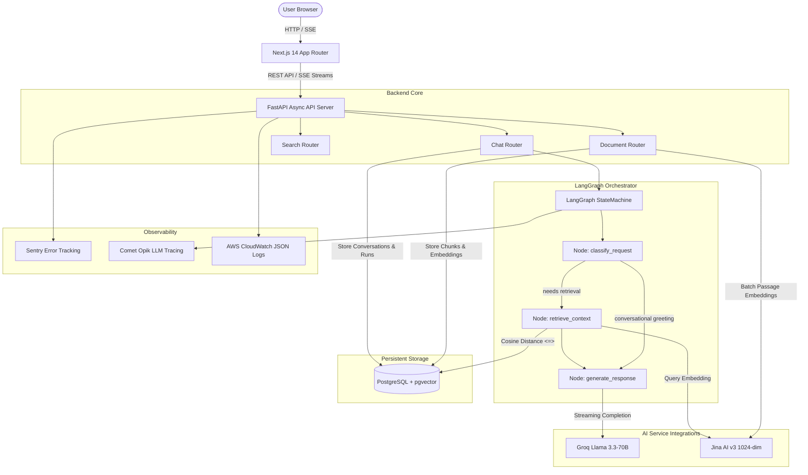
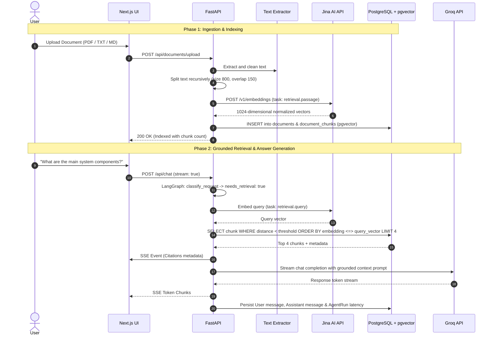

# Eve System Architecture & Engineering Guide

## 1. System Overview

Eve is designed as a production-style, modular AI assistant. The primary goal is delivering high-performance conversational AI and grounded retrieval (RAG) with transparent, testable, and loosely coupled components.

---

## 2. RAG (Retrieval-Augmented Generation) Pipeline

---

## 3. LangGraph Workflow Explanation

Eve uses a compiled `StateGraph` with a typed state dictionary (`AgentState`):

1. **`classify_request`**:
   - Inspects the user query, length, and conversation context.
   - Detects conversational greetings versus information-seeking queries.
   - Sets `needs_retrieval: boolean`.

2. **Conditional Routing (`route_after_classification`)**:
   - If `needs_retrieval == True`: Routes to `retrieve_context`.
   - If `needs_retrieval == False`: Skips directly to `generate_response`.

3. **`retrieve_context`**:
   - Generates the query embedding via Jina AI.
   - Performs a cosine similarity search against `document_chunks`.
   - Formats citations and returns them in the state.

4. **`generate_response`**:
   - Assembles system instructions, past turns, grounded excerpts, and current query.
   - Invokes Groq LLM (or prepares streaming prompt).
   - Records Opik spans and latency metrics.

---

## 4. Database Schema

- **`users`**: Optional user account and authentication mapping.
- **`conversations`**: Thread containers with title, timestamps, and message links.
- **`messages`**: Chronological turns with role, content, token count, and JSON citation references.
- **`documents`**: Ingested asset metadata, mime-type, status (`processing`, `indexed`, `failed`), and chunk counter.
- **`document_chunks`**: Discrete text segments, character boundaries, and `Vector(1024)` column with an HNSW index.
- **`agent_runs`**: Operational audit log recording node execution, retrieval decisions, and millisecond latencies.
